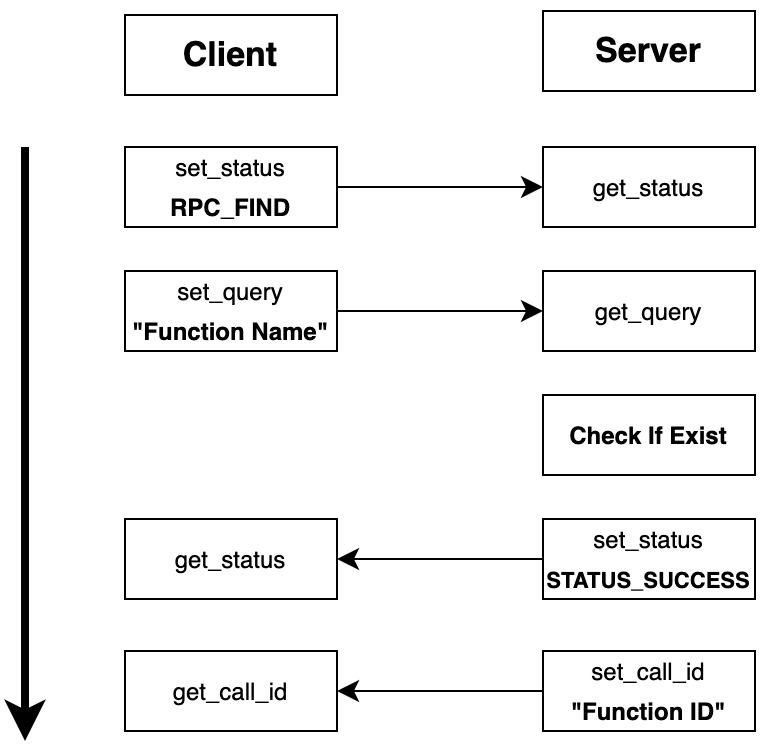
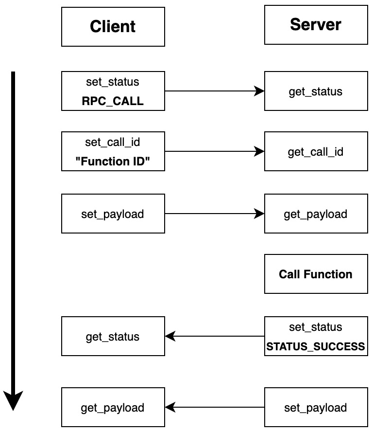

# Toy RPC
A Simple PRC framework in C.

## Usage

See [client.c ](./client.c)and [server.c](./server.c) for `Quick Start`.

Try it with:

```shell
make clean
make # compile rpc framework
make test # compile server&client
./server
# another terminal
./client
```

## Protocol Description

### Syntax & Semantics

#### 1.Status(1Byte)

STATUS_SUCCESS, STATUS_ERROR, RPC_FIND, RPC_EXIST, RPC_CALL

#### 2.Query

A String Of Function Name.

#### 3.RPC_DATA

```c
typedef struct {
    unsigned int data_len;
    void *data; // Size: <data_len> Bytes
} rpc_data;
```

#### 4.Call ID

An Integer.

### Timing

#### 1.RPC_FIND



#### 2.RPC_CALL


